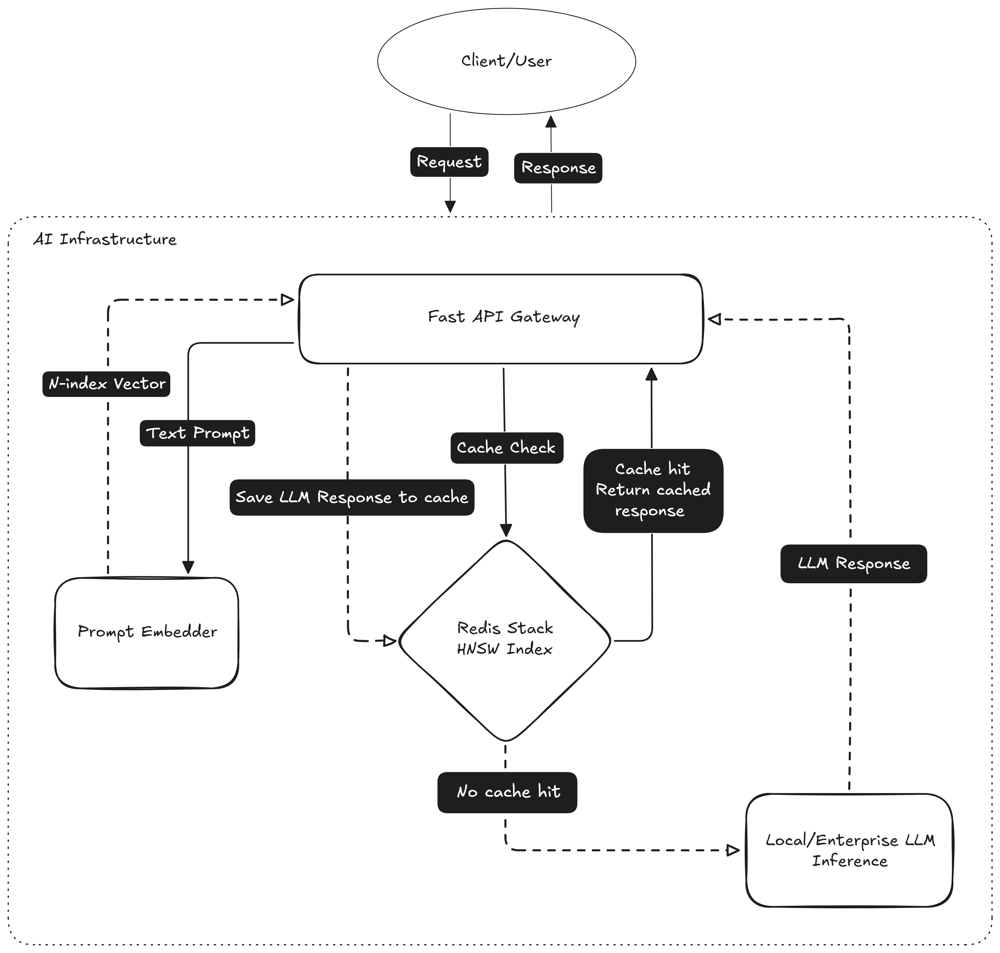

# Semantic Gateway

Cuts LLM inference costs by caching semantically equivalent queries — regardless of how they're phrased.

FastAPI gateway → Redis HNSW → Two-stage retrieval (BGE + ColBERT MaxSim).

---

## Example Use Cases

### 🤖 AI Customer Chat Support
In customer support, users frequently ask the same questions using different phrasing.
* **User A:** "How do I reset my password?" (Triggers LLM generation, takes 3s, costs $0.01)
* **User B:** "I forgot my password, how to change it?" (Hits semantic cache, takes <1ms, costs $0)
* **User C:** "Where is the password reset page?" (Hits semantic cache, takes <1ms, costs $0)

By caching these semantically identical requests, you drastically reduce OpenAI/Anthropic API bills and provide instant responses to end-users.

### ⚙️ AI CI/CD Workflows
When using LLMs in automated pipelines (e.g., automated code review, security scanning, or generating release notes), the same code diffs or commit messages might be processed multiple times across different branches or retried builds.
* **Build 1:** "Summarize these changes: `git diff ...`" (Triggers LLM generation)
* **Build 2 (Retry or Rebase):** "Summarize these changes: `git diff ...`" (Hits semantic cache instantly)

Speeds up the CI/CD pipeline and prevents redundant API calls for identical or highly similar code changes.

---

## Architecture



### Two-Stage Retrieval Pipeline

1. **Stage 1 — Candidate Retrieval:** BGE dense embeddings are searched via HNSW ANN (KNN-5) in Redis. Returns the top 5 nearest neighbours by cosine distance.

2. **Stage 2 — ColBERT Reranking:** Each candidate's stored ColBERT token matrix is scored against the query using MaxSim (sum of per-query-token maximum dot products). The highest-scoring candidate above `MAXSIM_THRESHOLD` is returned as a cache hit.

3. **Fallback:** If ColBERT embeddings aren't available, the gateway falls back to cosine distance + a 25% length variance check to reject false positives.

The thresholds are calibrated per-dataset using `scripts/calibrate_thresholds.py`, which sweeps both MaxSim and cosine distance values and reports F1-score with false-positive detection.


## Tech Stack

| Layer | What |
|---|---|
| API | FastAPI + Uvicorn |
| Dense Embeddings | `BAAI/bge-base-en-v1.5` (768-dim) via ONNX Runtime |
| Late Interaction Reranker | `colbert-ir/colbertv2.0` via PyTorch |
| Vector Store | Redis Stack (RediSearch HNSW) |
| Inference | Ollama (host-native), OpenAI, Anthropic |
| CI/CD | GitHub Actions → GHCR |
| Observability | `/health` probe, Prometheus `/metrics` endpoint |

---

## Prerequisites

- [Docker & Docker Compose](https://docs.docker.com/get-docker/)
- [Ollama](https://ollama.ai/) installed on the host (not in Docker — needs GPU access)

---

## Quick Start

### 1. Configure

```bash
cp .env.example .env
```

### 2. Provision Ollama

Make sure Ollama is installed and running on your host machine (so it can use your GPU). Pull the model you want to use, for example:
```bash
ollama pull tinyllama
```

### 3. Launch

```bash
docker compose up -d
```

The gateway starts on port `8000` after Redis passes its healthcheck.

### 4. Verify

```bash
curl http://localhost:8000/health
```

```json
{"status": "healthy", "redis": "connected"}
```

### 5. Calibrate thresholds (optional)

```bash
pip install -e ".[dev]"
python scripts/calibrate_thresholds.py
```

Updates `CACHE_THRESHOLD` and `MAXSIM_THRESHOLD` in `.env` based on your embedding model's behaviour.

---


## API

### `POST /api/v1/generate`

```bash
curl -X POST http://localhost:8000/api/v1/generate \
  -H "Content-Type: application/json" \
  -d '{"prompt": "What is the primary function of a reverse proxy?", "model": "tinyllama"}'
```

```json
{
  "cached": true,
  "response": "A reverse proxy sits in front of backend servers...",
  "latency_ms": 0.8
}
```

| Field | Meaning |
|---|---|
| `cached` | `true` = served from cache, `false` = fetched from LLM |
| `response` | The generated or cached response text |
| `latency_ms` | Total request time — cache hits are typically <1ms |

### `GET /health`

Checks if the server is healthy and connected to Redis.

### `GET /metrics`

Prometheus metrics endpoint. Shows:
- `gateway_requests_total` — total requests
- `gateway_cache_hits_total` / `gateway_cache_misses_total` — hit rate
- `gateway_llm_errors_total` — LLM failures
- `gateway_request_duration_seconds` — latency histogram

---

## Configuration

| Variable | Default | Description |
|---|---|---|
| `REDIS_URL` | `redis://localhost:6379` | Redis connection string |
| `OLLAMA_URL` | `http://localhost:11434` | Ollama API endpoint |
| `CACHE_THRESHOLD` | `0.22` | Max cosine distance for fallback cache hits |
| `MAXSIM_THRESHOLD` | `12.0` | Min ColBERT MaxSim score for cache hits |
| `VECTOR_DIMENSION` | `768` | Must match embedding model output |
| `EMBEDDING_MODEL_ID` | `BAAI/bge-base-en-v1.5` | HuggingFace model for dense embeddings |
| `COLBERT_MODEL_ID` | `colbert-ir/colbertv2.0` | HuggingFace model for late interaction |
| `CACHE_TTL_SECONDS` | `86400` | Cache entry expiry (24h) |
| `LOG_FORMAT` | `text` | `text` or `json` for structured logging |
| `LOG_LEVEL` | `INFO` | Python log level |

---

## Testing

50 prompt pairs across 5 domains (networking, Python, DevOps, ML, security). Phase 1 populates the cache, Phase 2 verifies hits:

```bash
docker exec semantic_cache_db redis-cli FLUSHALL
npx promptfoo@latest eval --no-cache -j 1
```

---

## Project Structure

```
.
├── app/
│   ├── api/v1/routes/
│   │   ├── gateway.py              # /generate endpoint
│   │   └── metrics.py              # /metrics (Prometheus)
│   ├── core/
│   │   ├── config.py               # Settings from env
│   │   └── http.py                 # Shared aiohttp session
│   ├── models/dto.py               # Request/response schemas
│   ├── services/
│   │   ├── cache.py                # Redis HNSW + ColBERT reranking
│   │   ├── embedder.py             # BGE (ONNX) + ColBERT (PyTorch)
│   │   └── llm.py                  # Ollama / OpenAI / Anthropic
│   └── main.py                     # FastAPI app + /health
├── scripts/
│   └── calibrate_thresholds.py     # Threshold sweep utility

├── docker-compose.yml              # Dev (hot-reload, persistent cache)
├── Dockerfile                      # Multi-stage build
├── promptfooconfig.yaml            # 100-prompt eval suite
└── pyproject.toml
```

---

## What's Next (Not in v1)

- [ ] Switch to a larger local embedding model for better accuracy
- [ ] Automate the continuous calibration pipeline using historical prompt logs
- [ ] Add automatic retries if Ollama fails

---

## License

MIT — see [LICENSE](LICENSE).
